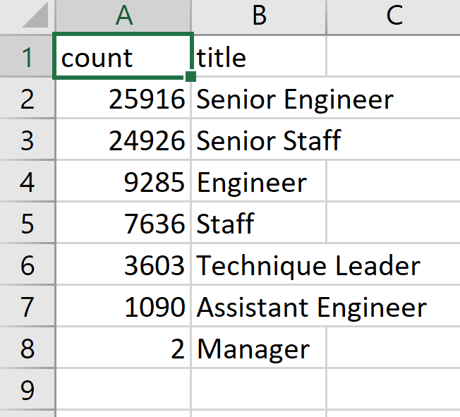
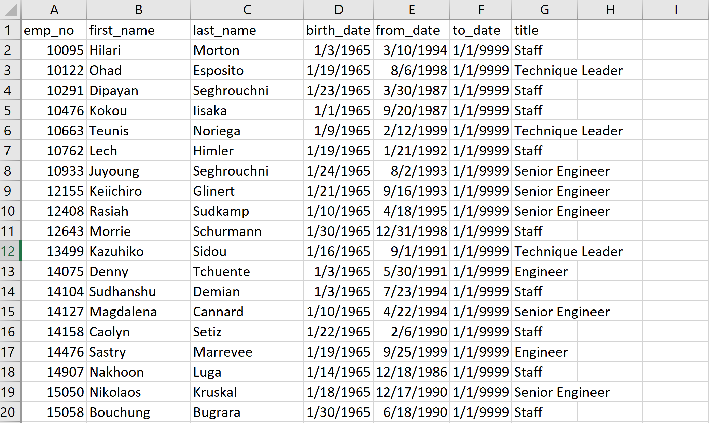

# Pewlett-Hackard-Analysis

## Overview of the analysis
To determine the number of retiring employees per title, and identify employees who are eligible to participate in a mentorship program. To create a report that summarizes the analysis and helps to prepate for the “silver tsunami” as many current employees reach retirement age. 

## Results
### Deliverable 1: The Number of Retiring Employees by Title 

-  a majority of the employees of retirement age have senior titles.
-  senior title stuff should be the main priority for hiring by the HR department 

### Deliverable 2: The Employees Eligible for the Mentorship Program 

- There are 1,549 employees who qualify for the mentorship program.
- There are more people retiring than there are possible mentors.

## Summary
- Company should plan to hire around 73000 new employees as "Silver tsunami" begins and most of the position is senior stuff.
- There are not enough retirees to mentor the new employees, according to current estimates. For the future the company should be better prepared for the "Silver Tsunami' and create queries the will return the possible future mentors.
